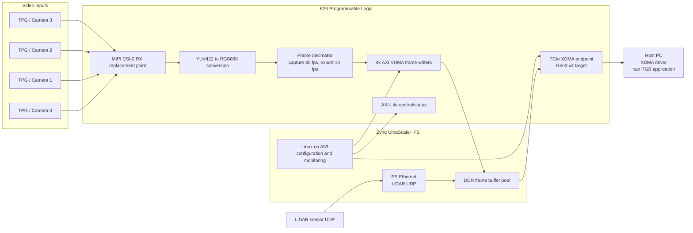

# Architecture Definition

## Project Goal

Demonstrate a simple, understandable reference design on AMD Kria K26 SOM that
captures four 1920 x 1536 video channels, converts YUV422 camera output to RGB,
buffers frames in DDR, and transfers selected raw RGB frames to a host PC using
PCIe XDMA.

The first milestone uses Vivado Test Pattern Generator inputs instead of real
cameras. This proves the video datapath, memory map, frame dropping, XDMA path,
and software flow without depending on sensor or carrier-board bring-up.

## High-Level Block Diagram



## Primary Raw Video Path

```text
MIPI CSI-2 / TPG
-> AXI4-Stream video
-> YUV422 to RGB888
-> AXI4-Stream frame decimator
-> AXI VDMA
-> PS DDR frame buffers
-> XDMA C2H
-> host PC
```

Raw RGB is the primary payload for host-side AI/ML. The PL should own the
high-bandwidth video datapath because video movement is deterministic and much
larger than the configuration workload. Keeping it in PL avoids CPU copies,
cache maintenance, Linux scheduling jitter, and A53 saturation. The A53 cores
remain useful for control-plane work: sensor configuration, IP register setup,
buffer address programming, health monitoring, and LiDAR UDP handling.

## Frame Rate Policy

Each source is accepted at the sensor rate of 30 fps. The decimator exports one
frame in every three frames to the host-facing buffer pool, giving an effective
10 fps per camera. The policy can be changed at run time by programming the
decimation factor through AXI-Lite.

The reference RTL provides a generic AXI4-Stream frame decimator. It expects
AXI4-Stream video convention where `tuser[0]` marks start-of-frame and `tlast`
marks end-of-line.

## PCIe Choice

Use PL PCIe Gen3 x4 with AMD DMA/Bridge Subsystem for PCIe configured as XDMA.
This aligns with the project requirement and uses the K26 PL GTH transceivers.

The design should expose:

- C2H channel for raw RGB frames.
- H2C channel optional for host commands or test traffic.
- BAR-mapped AXI-Lite control/status registers.
- MSI/MSI-X optional, polling acceptable for the first milestone.

## LiDAR Architecture Decision

Recommended initial choice: PS Ethernet with Linux UDP stack.

Reasons:

- 100 Mbps per LiDAR is modest compared with the video path.
- Linux UDP is easier to implement, log, test, and modify during architecture
  validation.
- It keeps PL resources focused on camera and PCIe movement.
- PL UDP parsing can be added later if deterministic timestamping, very low
  latency, hardware filtering, or direct packet classification becomes required.

Comparison:

| Option | Strengths | Weaknesses | Recommendation |
| --- | --- | --- | --- |
| PS Ethernet + Linux UDP | Fast to bring up, easy to debug, flexible packet handling | More CPU involvement, less deterministic timing | Use for phase 1 |
| PL Ethernet + UDP parser | Deterministic, can write packets directly to DDR, low CPU load | More RTL, more verification, longer bring-up | Defer to phase 2 |

## Hardware Assumptions

- Platform: AMD Kria K26 SOM using Zynq UltraScale+ MPSoC.
- Initial video sources: 4x Vivado Test Pattern Generator IP.
- Final video sources: 4x MIPI CSI-2 RX Subsystem IP instances, subject to
  carrier-board MIPI lane availability.
- Camera format: YUV422 8-bit.
- Host payload format: RGB888, packed 24-bit.
- Host OS: Linux with XDMA driver already available.
- Target OS: Linux on A53 for configuration and network handling.

## Vivado IP List

- Zynq UltraScale+ MPSoC processing system
- Video Test Pattern Generator, 4 instances
- Video processing subsystem or custom YUV422-to-RGB888 conversion
- AXI4-Stream frame decimator RTL, 4 instances
- AXI VDMA, 4 instances
- AXI SmartConnect / AXI Interconnect
- DMA/Bridge Subsystem for PCIe, XDMA mode
- AXI-Lite register block RTL
- Processor System Reset
- Optional ILA probes

## Register Map

Base address is assigned by Vivado address editor.

| Offset | Name | Access | Description |
| --- | --- | --- | --- |
| 0x00 | CONTROL | RW | bit0 enable, bit1 soft reset |
| 0x04 | DECIMATION | RW | Frames accepted per output frame; 3 gives 10 fps from 30 fps |
| 0x08 | WIDTH | RW | Active width, default 1920 |
| 0x0C | HEIGHT | RW | Active height, default 1536 |
| 0x10 | FRAME_BYTES | RW | Default 1920 x 1536 x 3 |
| 0x20 | STATUS | RO | bit0 running |
| 0x24 | FRAME_COUNT0 | RO | Output frame count channel 0 |
| 0x28 | FRAME_COUNT1 | RO | Output frame count channel 1 |
| 0x2C | FRAME_COUNT2 | RO | Output frame count channel 2 |
| 0x30 | FRAME_COUNT3 | RO | Output frame count channel 3 |

